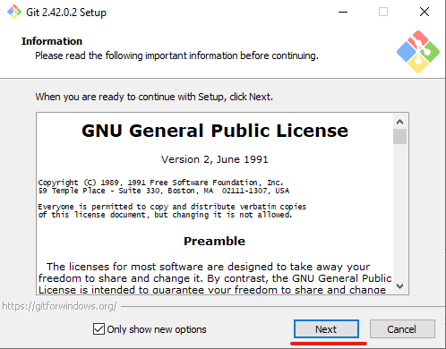
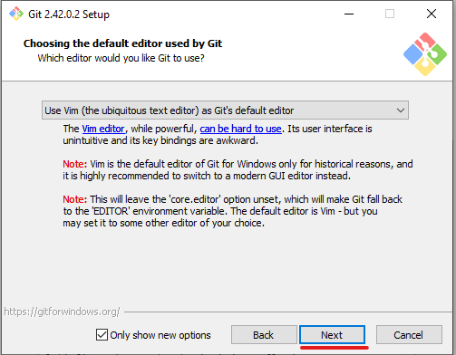
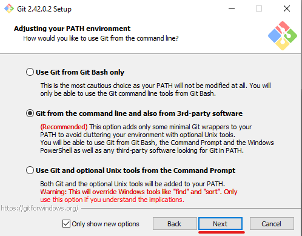
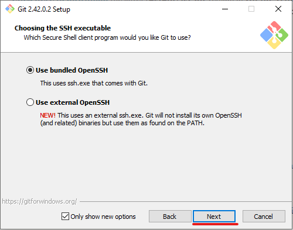
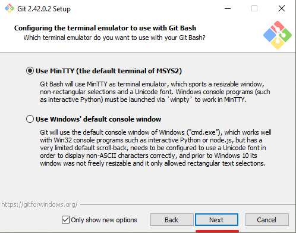
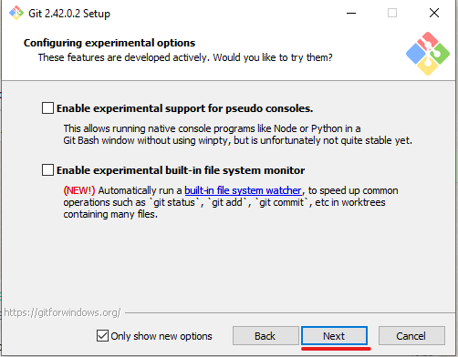
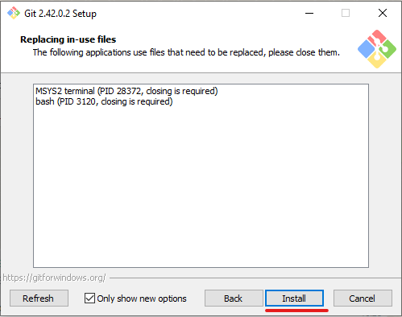

# Baixando o Git

- Baixe o [Git](https://git-scm.com/downloads) de acordo com o seu sitema operacional(Essa apostila vai mostrar a instalação no Windows).

- Ao Executar o *Instalador do Git* clique em **Next** quando aparecer essa tela.

- **Next** novamente

- **Next** novamente

- **Next** novamente

- **Next** novamente

- **Next** novamente

- **Install**

