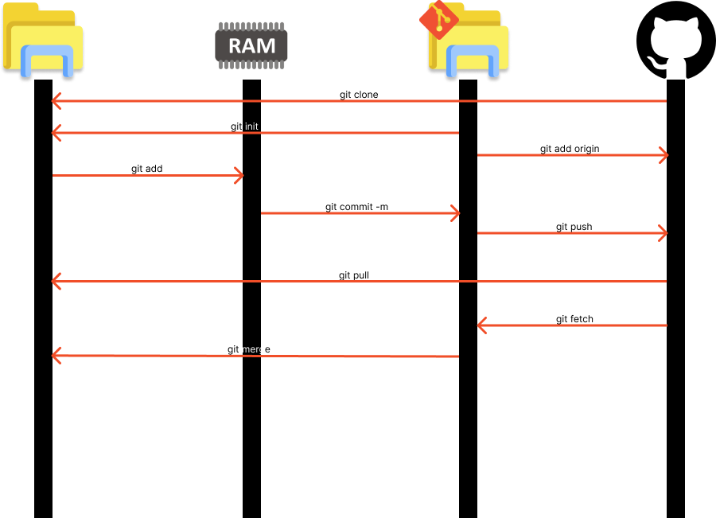

# Comandos básicos

Já vimos esses comandos em [Criando seu primeiro repositório](./criando_seu_primeiro_repo.md), mas eles também vão estar aqui.



---

## Para iniciar o *Repositório local* digite o seguinte comando:

```bash
git init
```

---

## Ligando um *Repositório local* a um remoto

> Faça o login do GitHub caso necessário

```bash
git remote add origin [LINK DO SEU REPOSITORIO]
```

---

## Verificando o status do *Repositório Remoto*

```bash
git remote -v
```

---

## Atualizando um *Repositório local*

```bash
git add [CAMINHO DO QUE QUER JOGAR NO REPOSITÓRIO LOCAL OU . PARA ADICIONAR TODOS ARQUIVOS QUE FORAM ALTERADOS ]
```

---

## Realizando um *commit* local.

> Um commit é a realização permanente de um conjunto de tentativas de alteração, marcando o fim de uma transação e fornecendo durabilidade às transações ACID.

```bash
git commit -m "DIGITE AQUI A SUA MENSAGEM"
```

---

## Enviando o *commit* também para o GitHub pela primeira vez

Vamos criar uma Branch chamadada master no GitHub

```bash
git push --set-upstream origin master
```

### Observação apartir do momento que você da o comando acima você só precisa digitar

```bash
git push
```

### Enviando a atualização para uma Branch específica

```bash
git push [NOME DA BRANCH]
```

---

## Atualizando o seu *Repositório Local* trazendo as modificações do *Repositório Remoto*

```bash
git pull
```

### Atualizando o seu *Repositório Local* trazendo as modificações do *Repositório Remoto* com base em uma Branch

```bash
git pull [NOME DA BRANCH]
```

---

## Baixando um *Repositório Remoto* da internet

```bash
git clone [LINK DO REPOSITORIO]
```


---