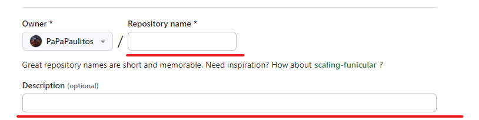
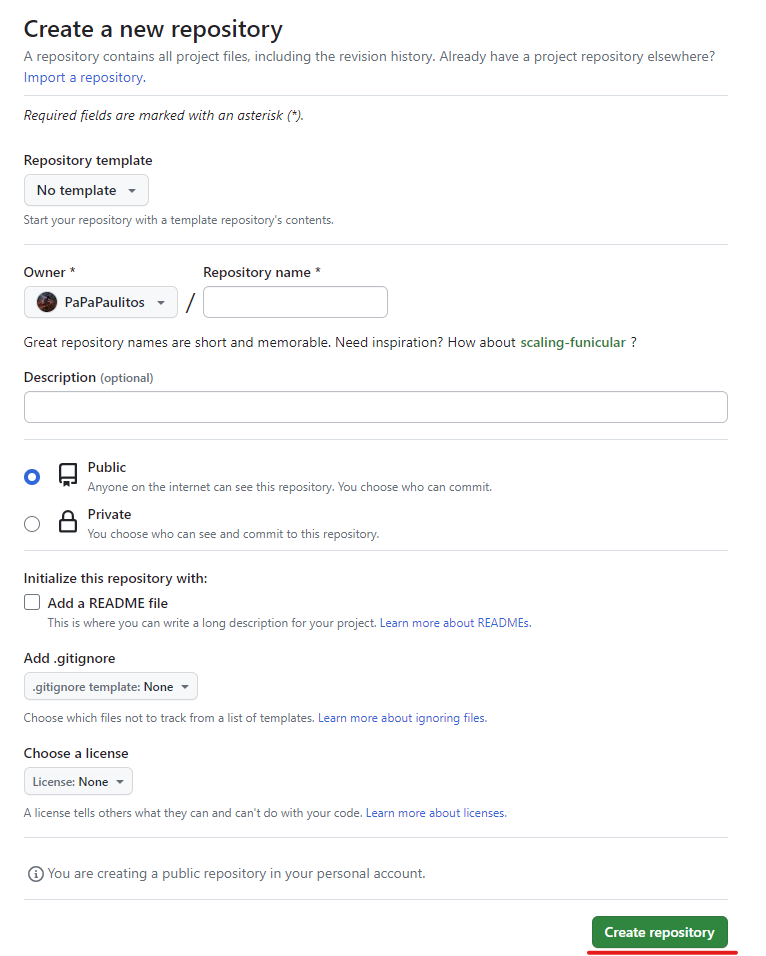

# Criando o seu primeiro repositório

## Pré-requisitos

- Baixar o [Git](./baixando_o_git.md)

- Ter uma conta no [GitHub](https://github.com/signup?ref_cta=Sign+up&ref_loc=header+logged+out&ref_page=%2F&source=header-home)

## Criando o Repositório no GitHub

- Clique no botão de **+** no canto superior direto no GitHub.


- Clique em **New repository**


## Explicando os campos

### *Repository template*

Serve caso você queira reutilizar o template de outro repósitorio, como exemplo um repósitorio configurado com o Google Colab para ciência de dados, normalmente não utilizar esse campo, então deixamos o **Default** que é **No template**.


Mostrando as opções desse campo


### *Owner*

Esse campo é para decidir se o Repositório vai ser seu ou de alguma organização que você faz parte.


Mostrando as opções desse campo


### *Repository name e Description*

São os campos que vão dar o nome e a descrição do repositório no seu GitHub ou da organização, sendo descrição *opcional*, pois nossa documentação vai ser feita usando *MarkDown*



Mostrando aonde aparece esses campos em um Repósitorio.


### *Visibilidade*

Sendo os campos mais importantes eles funcionam da seguinte forma:

- *Public*: Ao marcar esse campo o seu repositório vai estar visivel para todos usuários do GitHub.

- *Private*: Ao marcar esse campo o seu repositório vai estar visivel para você e todos a quem você conceder acesso.

> É interessante começar todos repositórios como privado e depois mudar a sua visibilidade para público.


### *add a README file*

É interessante deixar essa opção marcada, pois é mais fácil de documentar escrevendo um **MarkDown**, temos uma sessão só sobre esse assunto nessa apostila.

> Inclusive essa apostila que você está lendo foi escrita em **MarkDown**


### *Add .gitignore*

O arquito *.gitignore* faz com que a nós possamos reduzir o tempo e espaço na hora de subir um repositório, só deixando arquivos essenciais para executar um código, ignorando arquivos binários como *.exe*, *node_modules* em JavaScript, *venv* e *pycache* em Python e assim por diante.

> É interessante você já escolher um template de .gitignore se souber a linguagem que vai trabalhar


### *Choose a license*

Essa opção é mais caso você queira dar uma licença já existente pro seu software, a mais utilizada é a do [*MIT* para programas *Open Source*](https://www.diegobrocanelli.com.br/open-source/a-licenca-mit/).

### Iniciando o Repositório

Agora com os dados cadastrados conforme a necessidade podemos clicar no botão **Create repository**



---

## Criando Repositório local e conectando ele ao GitHub

- Crie uma pasta no seu computador com o nome do projeto

- Entre na pasta, clique com o botão direito e clique em *Git Bash Here*.


- Ela vai abrir essa tela.


- Para iniciar o *Repositório local* digite o seguinte comando:

```bash
git init
```

- Agora para conectar ele ao GitHub use o seguinte comando:

> Faça o login do GitHub caso necessário

```bash
git remote add origin [LINK DO SEU REPOSITORIO]
```

- Adicione ao Repositorio para testa-lo


- Digite o seguinte comando para jogar as mudanças no *Repositório local*

```bash
git add .
```

- Digite uma mensagem para o *commit*

> Um commit é a realização permanente de um conjunto de tentativas de alteração, marcando o fim de uma transação e fornecendo durabilidade às transações ACID.

```bash
git commit -m "DIGITE AQUI A SUA MENSAGEM"
```

- Envie o *commit* também para o GitHub

```bash
git push --set-upstream origin master
```

> Observação apartir do momento que você da o comando acima você só precisa digitar

```bash
git push
```

- Verifique o GitHub


