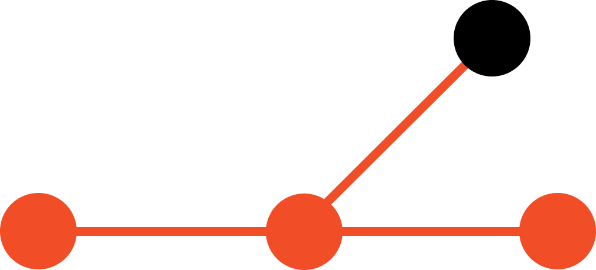
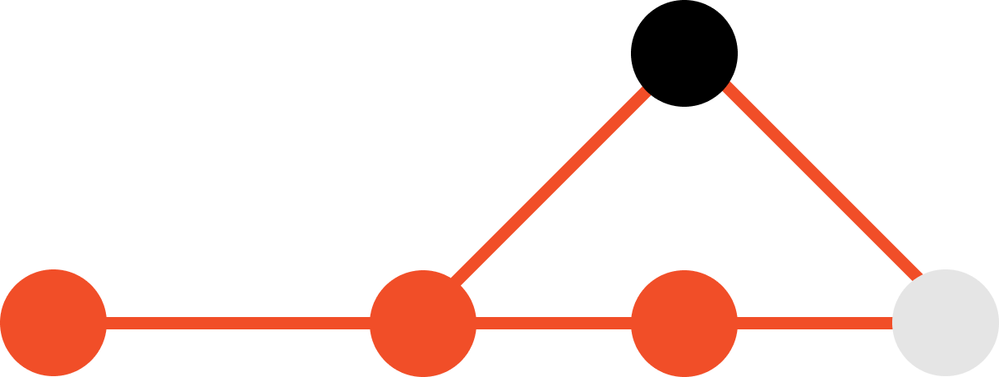

# Dicionário Git

### Commit

O "commit" no Git é um comando usado para salvar as mudanças feitas em um repositório. Cada commit representa um ponto na linha do tempo do projeto e inclui um conjunto de alterações que podem ser acompanhadas e referenciadas posteriormente.

### Fork

Um "fork" no Git é a ação de criar uma cópia independente de um repositório Git existente. Essa cópia, chamada de "fork", é geralmente feita por um colaborador externo que deseja contribuir para o projeto original, mas não tem permissões diretas para modificar o repositório principal. Portanto, o fork permite que essa pessoa crie sua própria cópia do repositório, na qual ela tem controle total, e pode fazer alterações sem afetar diretamente o projeto original.

### Branch

Um "branch" em Git é uma ramificação independente da linha principal do desenvolvimento. Ele permite que você trabalhe em novas funcionalidades ou correções de bugs sem afetar o código principal. Os ramos podem ser criados, mesclados e excluídos para gerenciar o fluxo de desenvolvimento.

### Merge

"Merge" é o processo de combinar as alterações de um branch em outro. Isso é comumente usado para incorporar o trabalho feito em um branch de desenvolvimento de volta ao branch principal. O Git tenta automaticamente fundir as alterações, mas conflitos podem ocorrer, exigindo intervenção manual.

### Push

"Push" é um comando usado para enviar as alterações locais de um repositório Git para um repositório remoto. Isso sincroniza o repositório remoto com as alterações locais, tornando-as acessíveis a outros colaboradores do projeto.

### Pull

"Pull" é um comando que combina dois passos: "fetch" e "merge". Ele é usado para atualizar seu repositório local com as alterações do repositório remoto. Primeiro, ele busca as alterações do repositório remoto (fetch), e em seguida, combina essas alterações com seu branch local (merge), mantendo seu código atualizado com o trabalho de outros colaboradores.

Esses são termos essenciais para entender o funcionamento básico do Git, uma poderosa ferramenta de controle de versão amplamente utilizada no desenvolvimento de software.

## Pull Request

Um "Pull Request" (ou PR) é uma solicitação feita por um colaborador para que suas alterações em um branch sejam incorporadas ao branch principal do repositório. É uma ferramenta essencial para o trabalho colaborativo no Git, pois permite que os colaboradores revisem, discutam e, eventualmente, aceitem ou rejeitem as alterações propostas antes de serem mescladas no branch principal. O Pull Request ajuda a manter um controle rigoroso sobre as contribuições e a qualidade do código.

Este termo é crucial para entender como as contribuições são gerenciadas em projetos Git de código aberto e privados.

> - [Clique aqui para ver mais detalhamente tudo sobre o funcionamento do Pull Request e suas regras](./pull_request.md)
> - **Créditos ao Paulo Victor**

> Criador da linguagem de programação *Python*, considerado um ditador benevolente da linguagem, toma as decisões que decidem o rumo da sua criação, uma das ferramentas para isso é o *Pull Request*.
> Guido deixou o seu cargo em Julho de 2018