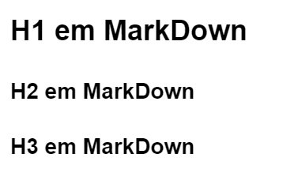

# Aprendendo a documentar projetos

## Para que serve a documentação?

Proavavelmente você já teve um código que escreveu e não lembra mais como funciona ou a sua estrutura, caso ainda não tenha, saiba que algum dia vai ter.
A documentação serve justamente para resolver esse problema, você conseguir lembrar de pontos importantes e criticos do seu projeto, sem ter que recorrer a comentários no código, a final documentar é para a documentação.

> [Aprenda conceitos básicos de *Clean Code*](https://www.youtube.com/watch?v=9w3o9NHXqu0)

## Até onde vale a pena documentar?

Então antes da documentação tinhamos o que chamavam de *arte de codar*, onde os desenvolvedores faziam códigos do seu jeito, sendo cada código a sua arte, mas esse processo era inviavel para manutenção de códigos, então logo foi adquirido o [**RUP -** ***Ration Unified Process***](https://www.treinaweb.com.br/blog/o-que-e-rup-rational-unified-process#:~:text=A%20metodologia%20RUP%20utiliza%20uma,caracter%C3%ADsticas%20ser%20incremental%20e%20iterativo.), que era um processo muito burocrático de documentação.

Então no começo dos anos 2000 os desenvolvedores irritados com o tempo que era perdido documentando os seus projetos, criaram o [*Manifesto Ágil*](https://agilemanifesto.org/iso/ptbr/manifesto.html), onde foi decido que só seria documentado o que desenvolvedor considerasse importante, perdendo assim mesmo tempo com documentação e mais com código.

## Aonde documentar?

Existem diversas ferramentas para documentar e a documentação deve ser feita a partir da escolha da equipe, segue algumas ferramentas de documentação.

- Notion
- Obsidian
- Confluence
- BookStack
- GitHub
- Discord

## Como documentar

A padronização da documentação é escrita em [**MarkDown**](https://www.markdownguide.org/) que converte o seu texto para *HTML* válido de maneira simples.

> Podemos escrever em HTML direto no MarkDown caso queiramos


### Titúlos

Assim como no HTML nós temos hierarquias de Titulos em páginas usando o **MarkDown**, mas aqui só podemos usar do H1 até o H3.

> Para isso usamos `#`, sendo uma `#` o H1, `##` e `###` o H3.



### Listando elementos em MarkDown

Para listar elementos como abaixo:

- Um elemento
- Dois elementos
-  Três elementos

Nós usamos `-` para antes de ligar cada elemento como `- Um elemento`.

### *Itálico* ou **Negrito**

Para deixar elementos em *Itálico* ou **Negrito** nós colocamos as palavras entre `*`, sendo `*palavra*` o *Itálico* e `**palavra**` o **Negrito**.

### Observação

Para a gente escrever observações como essa:

> Isso é uma observação!!!

Nós usamos `>` antes de uma frase como `> Isso é uma observação!!!` .

### Trecho de código

Para escrever um trecho de código como esse

    ```python
    print("Hello Git!")
    ```

Nós precisamos usar código entre ` ``` ` e colocar a linguagem logo após as 3 crases assim como:

    ```python
    print("Hello Git!")
    ```

### Notação simples

Para escrever uma notação simples assim como:

`Isso daqui oh!`

É só colocar seguir esse padrão 

    `Isso daqui oh!`

### Imagens e links

Para colocar um link nós usamos:

    [TEXTO](LINK AQUI)

Para ser dizer que o *Link* é uma imagem é só colocar **!** na frente

    
