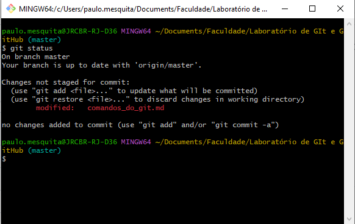
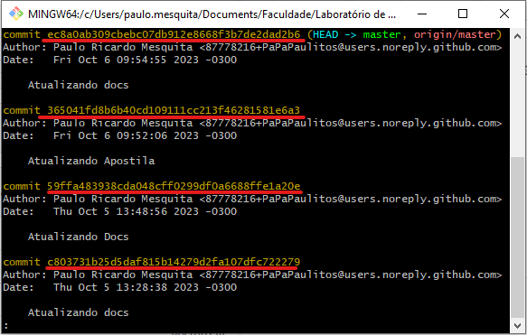

# Trabalhando com versionamento


## Vendo a lista de modificações em um *Repositório Local*

```bash
git status
```



---

## Removendo todas alterações de um *Repositório Local*

```bash
git reset
```

## Verificando o ID dos *commits*

```bash
git log
```



> O que está sublinhado em vermelho são os *ids* dos commits

## Voltando um commit temporariamente

```bash
git checkout [id]
```


> Como podemos ver na imagem quando usamos esse comando, nós voltamos um commit, mas não removemos os commits depois dele.


## Deletando todos commits a partir de uma data

```bash
git reset --hard [id]
```
```bash
git add .
```
```bash
git commit -m "MENSAGEM DIZENDO QUE VOLTOU O COMMIT"
```

Agora vamos forçar o repositório remoto voltar também.

```bash
git push --force origin main
```


> Nesse caso vamos voltar o repositório para o commit que selecionamos, assim deletando os commits que foram feitos posteriormente a esse.
