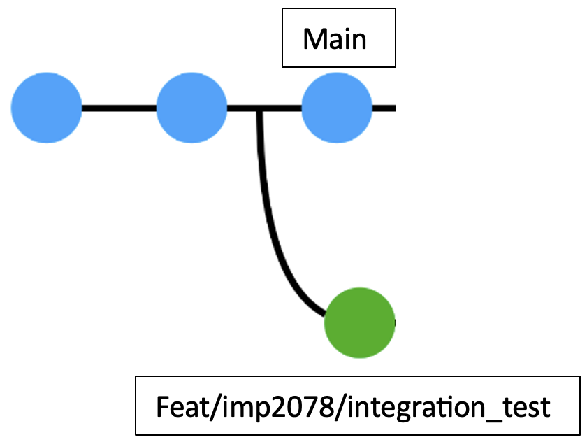
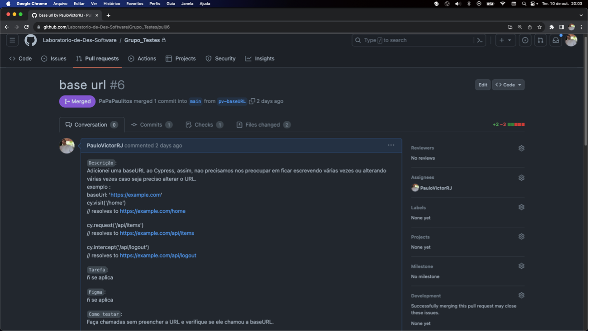
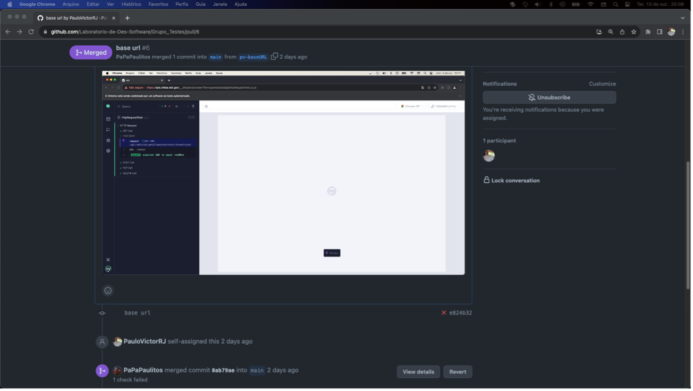
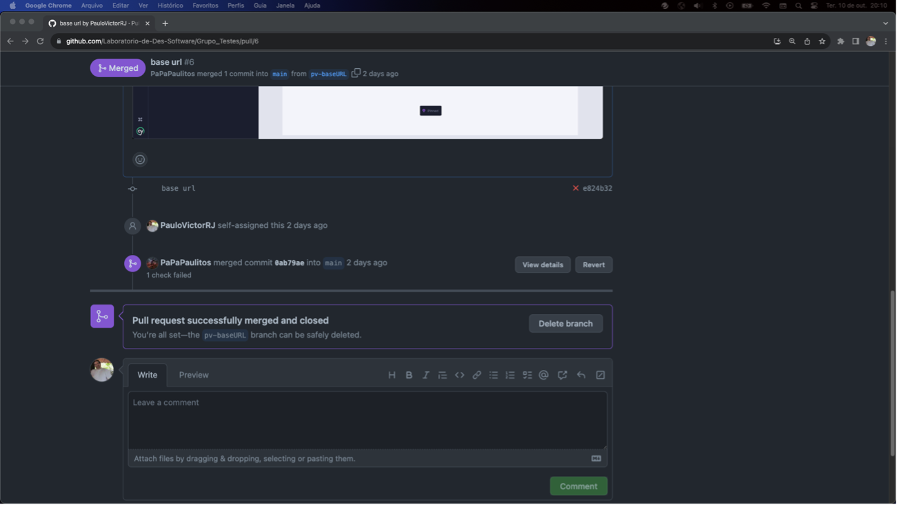
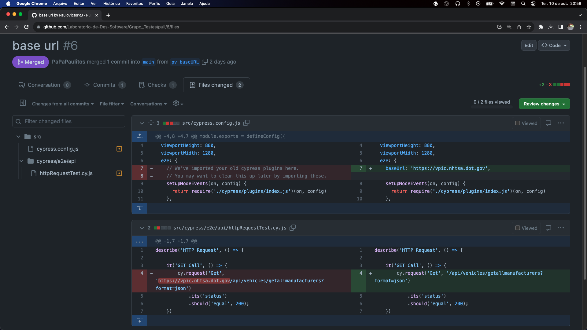
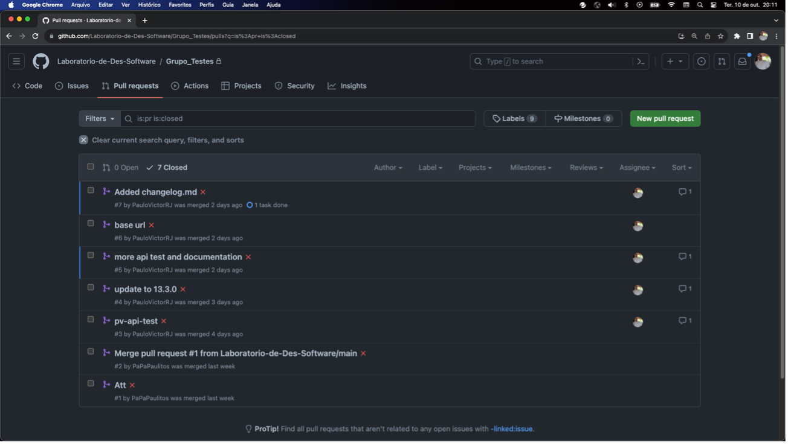
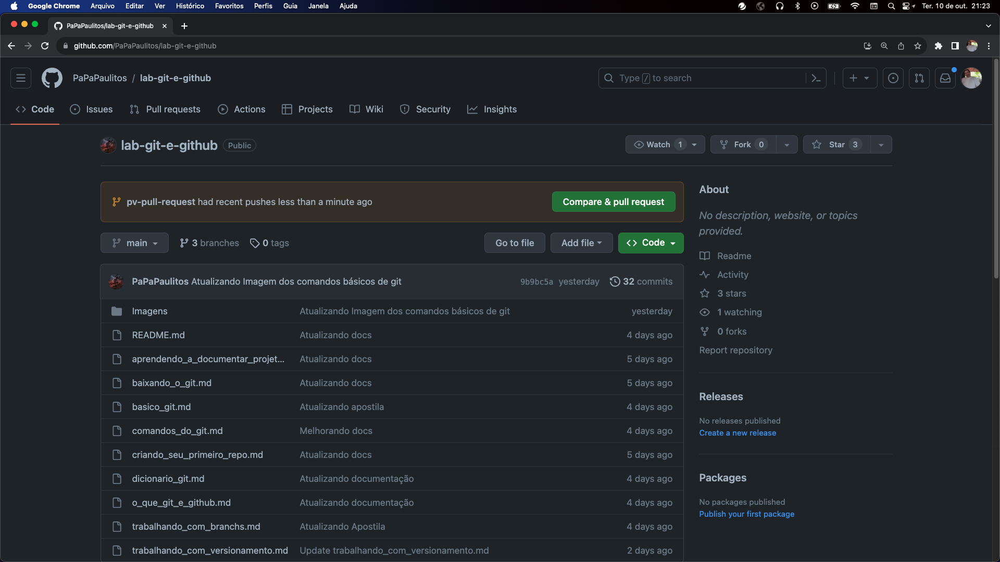
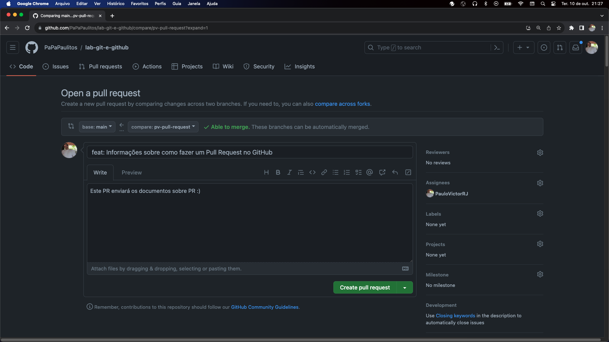

# Introdução

Por questões de boas práticas no uso do versionamento de código, sempre que precisamos 
alterar o código vigente, devemos criar uma **branch** a partir deste 
código vigente, geralmente com algo que identifique o tipo de tarefa que faremos, um 
código único, geralmente de um processo Ágil como o Kanban e um resumo.

Segundo o site [www.conventionalcommits.org](http://www.conventionalcommits.org), usando
 a padronização do commit para criação de **branches**, devemos usar
a palavra **feature** para a criação de um novo recurso ao nosso código.

Resumidamente podemos usar:

-   **feat**: (new feature for the user, not a new feature for build
    script)

-   **fix** (bug fix for the user, not a fix to a build script)

-   **docs**: (changes to the documentation)

-   **styles**: (formatting, missing semi colons, etc; no production code
    change)

-   **refactor**: (refactoring production code, eg. renaming a variable)

-   **test**: (adding missing tests, refactoring tests; no production code
    change)

-   **chore**: (updating grunt tasks etc; no production code change)

Sendo assim, com uma tarefa no Kanban Force conforme foto abaixo, um bom
nome para uma nova **branch** seria: feat/imp2078/integration_test

Feat: É a criação, ou seja, o projeto não tinha este recurso.

Imp2078: Identificação única dessa tarefa dentro do Kanban Force da
empresa.

Integration_test: Resumo da tarefa.

Criando uma nova branch.

Uma vez que a branch foi criada, podemos iniciar o desenvolvimento
normalmente, como se estivéssemos na branch original, neste caso a main.
Nada diferente do uso normal, porém, quando chegar a hora de enviar as
alterações, ou seja, o desenvolvimento feito, será necessário criar um
PR (*PULL REQUEST*).

# Pull Request

O pull request, ou PR, é uma solicitação para enviar o que você
desenvolveu para o código original. A princípio parece que apenas
burocratizamos o processo de enviar o que desenvolvemos, o que poderia
ter sido feito através de commits direto na branch main, mas nem de
longe é realmente isso que acontece.

Um PR traz algumas vantagens de enorme valor, como:

- **Identificação do Criador:** Exibe o autor do Pull Request (PR), oferecendo transparência sobre sua origem.

- **Branch de Destino:** Indica a branch na qual o PR será mesclado, mostrando claramente para qual ramificação as alterações estão direcionadas.

- **Branch de Desenvolvimento:** Revela o nome da branch onde o novo código foi desenvolvido. Isso permite que outros programadores baixem e testem o código em suas próprias máquinas, sem comprometer a estabilidade do código original.

- **Descrição Detalhada:** Inclui um campo para a descrição da tarefa realizada, permitindo recursos avançados como links, fotos e vídeos para demonstrar seu funcionamento ou qualquer outro aspecto relevante para a tarefa em questão.

- **Registro Cronológico de Alterações:** Apresenta, de forma cronológica, os commits e modificações no PR, incluindo alterações na descrição, conteúdo e outros elementos. Isso evita a possibilidade de ações maliciosas, como a troca do responsável pelo PR ou manipulação indevida de trechos de código.

- **Visão Clara das Alterações:** Detalha as modificações propostas pelo PR no código original, facilitando a compreensão para todos os programadores envolvidos. Isso proporciona uma compreensão fácil e rápida do que será alterado.

- **Participações e Melhorias Colaborativas:** Permite que outros programadores façam questionamentos e sugiram melhorias. O responsável pelo PR pode implementar essas melhorias, e os demais programadores podem revisar novamente, gerando novos comentários. Esse processo iterativo continua até que o PR seja aprovado por todos os envolvidos e esteja pronto para ser mesclado no código principal.

E muitas outras vantagens. Muitas mesmo!

Abaixo temos a foto de PR:

Podemos ver que ele esta apontado para a branch main e foi criado com a
branch pv-baseURL.
Abaixo destas informações temos um campo para descrição com algumas informações sobre o PR,
seu funcionamento e etc.
A direita, em verde e vermelho podemos ver que este PR está apagando 3
linhas de código e adicionando 2.

Abaixo temos a continuação do PR:

Descendo um pouco mais, temos uma foto na descrição, provando que o PR
está funcionando e 2 informações em ordem cronológica.

Abaixo temos a parte final deste PR:

No final do PR, temos um campo para que outros programadores para
comentar algo sobre o PR.

A foto abaixo mostra o que será alterado no código vigente caso este PR seja aprovado:

O que esta em verde é a parte de código que será adicionada e o que está em vermelho, o que será removido do código vigente.

Agora, como um projeto mostra a lista de PR:

# Criando um Pull Request
Criar um PR é muito simples, bastando criar uma branch nova antes do início do desenvolvimento, conforme dito no início deste documento, enviar para o GitHub normalmente (Git push) e depois acessar o GitHub do projeto com seu navegador de internet. Veja as fotos abaixo:

Clique em "Compare e pull request"

Agora basta selecionar a branch de destino, neste caso a 'main' e a branch onde está o código deste PR, neste caso 'pv-pull-request'.
obs.: Por se tratar de um projeto simples, não foi utilizado nenhum tipo de convenção no nome desta branch.
E no final, clicar em 'create pull request'.

